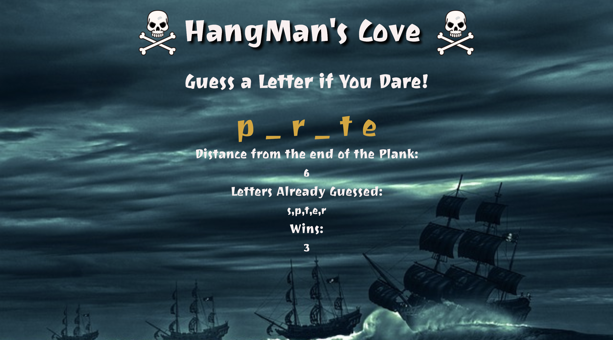
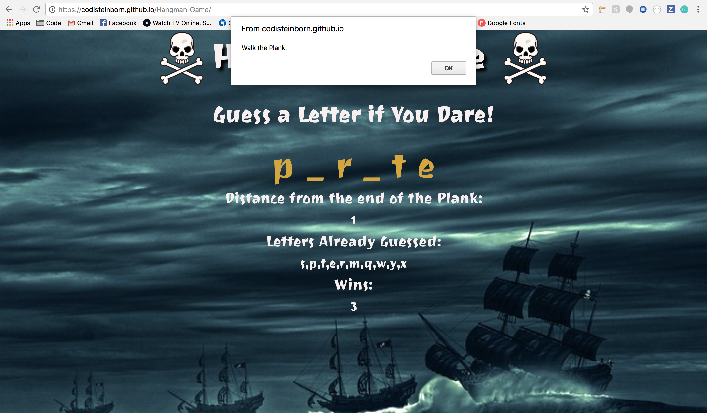

# Hangman-Game

<https://github.com/codisteinborn/Hangman-Game> \
Version 1.0 \
Original Deployment Date - January 18, 2018

# Users Guide:

Application Link - <https://codisteinborn.github.io/Hangman-Game/>

Game Overview:
This is a basic Hangman game where the computer will generate a random word from a pre-determined array of words. The user then guesses a letter on his or her keyboard and the computer will tell you whether or not that letter is in the word.

Guessing:
Each time the user guesses a correct letter the computer will fill that letter into the word. When all correct letters are guessed and the word is complete, the computer will log your win and choose another random word and the game will start over.

Each wrong guess will reduce your remaining guesses by one until you reach 0 guesses. The computer will then display a notification that you have lost. Once you dismiss this notification the computer will choose another random word and the game starts over.

# Built Utilizing:

Bootstrap v3 - <http://getbootstrap.com/docs/3.3/> \
Google Fonts - <https://fonts.google.com/> \
